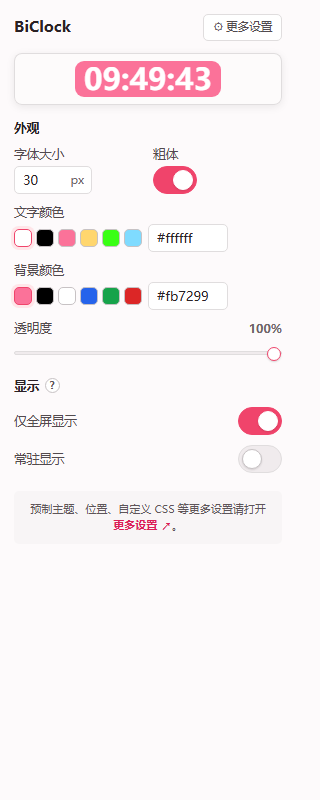

# BiClock · Bilibili 时钟

一个轻量的 Manifest V3 浏览器扩展。在 Bilibili 播放器顶部叠加显示当前时间,样式与位置完全可自定义。

[功能](#功能) · [预览](#预览) · [安装](#安装) · [使用](#使用)

同一套代码、同一个安装包同时支持 Chromium(Chrome / Edge 等)与 Firefox。

## 功能

- **播放器顶部时钟** —— 在 Bilibili 视频播放器顶部叠加显示当前时间(24 小时制,含秒)
- **两种显示模式** —— *鼠标触发*(默认,控件可见时才显示)或*常驻*(进入全屏后一直显示)
- **完全可自定义** —— 字号、文字颜色、背景色、背景透明度、加粗
- **颜色快选** —— 文字 / 背景色各提供一组常用色块,点选即用;也可直接输入十六进制颜色值精确指定
- **二维位置调节** —— 在 popup 的位置面板上拖动 ⏰ 即可设定时钟在视频画面内的任意位置
- **实时生效** —— popup 中的每一项改动都会自动保存,并即时同步到已打开的 Bilibili 标签页,无需刷新
- **跨浏览器** —— Manifest V3,同时支持 Chrome / Edge / Firefox
- **零依赖、零构建** —— 纯原生 JS,加载即用

## 预览

> 扩展弹窗(popup)的设置界面,分为外观、显示、位置三个分区,顶部为时钟的实时预览。

## 安装

### Chrome / Edge(Chromium 系)

1. 打开 `chrome://extensions`(Edge 为 `edge://extensions`)
2. 右上角打开「开发者模式」
3. 点击「加载已解压的扩展程序」,选择本项目文件夹

### Firefox

1. 打开 `about:debugging#/runtime/this-firefox`
2. 点击「加载临时附加组件…」
3. 选择本目录下的 `manifest.json`

> [!TIP]
> Firefox 临时附加组件在浏览器关闭后会失效。若需永久安装,需将扩展签名(提交到 [addons.mozilla.org](https://addons.mozilla.org)),或使用 [Firefox Developer Edition / Nightly](https://www.mozilla.org/firefox/developer/) 并设置 `xpinstall.signatures.required = false`。

## 使用

1. 打开任意 Bilibili 视频页(`/video/` 或 `/bangumi/`)
2. 按 **F11** 进入浏览器全屏
3. 移动鼠标使控制条显示,时钟出现(默认的鼠标触发模式)
4. 点击工具栏的扩展图标,在 popup 中切换显示模式、自定义样式或拖动位置,改动即时生效

## 设置

所有改动自动保存到 `chrome.storage.local`,无需点击保存按钮。

| 设置项 | 说明 |
| --- | --- |
| 字体大小 | 时钟文字大小(px) |
| 文字颜色 | 时钟前景色;色块快选或直接输入 Hex 值 |
| 背景颜色 + 透明度 | 背景以 `rgba()` 形式应用,透明度 0–100%;背景色同样支持色块与 Hex 输入 |
| 粗体 | 是否加粗显示 |
| 仅全屏显示 | 开(默认)= 只在浏览器全屏下显示;关 = 普通播放 / 宽屏 / 网页全屏也都显示 |
| 常驻显示 | 关(默认)= 控件可见时才显示(鼠标触发);开 = 在「仅全屏显示」选定的范围内一直显示 |
| 位置 | 拖动面板里的 ⏰ 设定时钟在播放器中的位置 |

## License

[MIT](./LICENSE)
