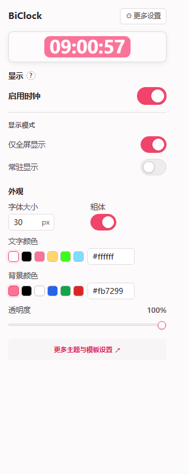
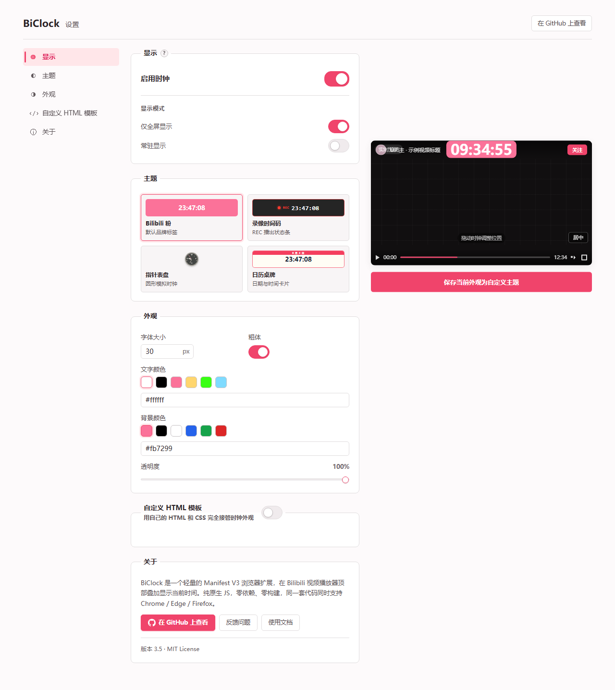

# BiClock · Bilibili 时钟

一个轻量的 Manifest V3 浏览器扩展。在 Bilibili 播放器顶部叠加显示当前时间,样式与位置完全可自定义。

[功能](#功能) · [预览](#预览) · [安装](#安装) · [使用](#使用)

同一套代码、同一个安装包同时支持 Chromium(Chrome / Edge 等)与 Firefox。

## 功能

- **播放器顶部时钟** —— 在 Bilibili 视频播放器顶部叠加显示当前时间(24 小时制,含秒)
- **总开关「启用时钟」** —— popup 与设置页各置顶一个总开关,关掉后时钟在播放器里完全不出现,其它外观 / 显示设置也随之折叠;在播放器里也能用时钟右上角的「×」菜单一键关闭
- **两种显示模式** —— *鼠标触发*(默认,控件可见时才显示)或*常驻*(进入全屏后一直显示)
- **直接拖动定位** —— 在播放界面按住时钟即可拖动,或在设置页预览栏里拖动,两边共用同一份位置
- **完全可自定义** —— 字号、整体缩放（含自定义 HTML 模板）、文字颜色、背景色、背景透明度、加粗
- **颜色快选** —— 文字 / 背景色各提供一组常用色块,点选即用;也可直接输入十六进制颜色值精确指定
- **主题与形态** —— 4 个预制主题(Bilibili 粉 / 录像时间码 / 指针表盘 / 日历桌牌)+ 用户保存的任意数量自定义主题,可重命名、更新、删除
- **自定义 HTML 模板** —— 用自己的 HTML + CSS 完全接管时钟外观,支持 `{{hh}} {{mm}} {{ss}} {{time}}` 占位符与 SVG 装饰等任意结构;模板里的装饰元素只渲染一次、每秒只刷新占位符文本
- **AI 帮你写模板** —— 设置页内置一段可直接复制给任意 LLM 的提示词,把你想要的视觉效果描述一句,粘贴回来就能用;不想写代码也能一键载入起步模板
- **专门设置页** —— 点击 popup 的「更多设置」打开完整的设置标签页:左侧分区导航 + 中间滚动控制面板(总开关、显示、主题、外观、自定义 HTML 模板、关于)+ 右侧还原 B 站播放器外壳的实时预览
- **实时生效** —— popup 与设置页中的每一项改动都会自动保存,并即时同步到已打开的 Bilibili 标签页,无需刷新
- **跨浏览器** —— Manifest V3,同时支持 Chrome / Edge / Firefox
- **零依赖、零构建** —— 纯原生 JS,加载即用

## 预览

> 扩展弹窗(popup):顶部为时钟实时预览,下方为「快速调整」子集——显示分区(顶部「启用时钟」总开关 + 仅全屏显示 / 常驻显示两个显示模式开关)与外观分区(字号 / 粗体 / 文字颜色 / 背景颜色 / 透明度)。预制主题、位置、自定义 HTML 模板等完整功能在「⚙ 更多设置」打开的设置页中。

> 设置页(options):三栏布局——左侧分区导航、中间滚动控制面板(顶部「启用时钟」总开关卡片,然后是显示、主题网格、外观、自定义 HTML 模板含 AI 生成提示词与起步模板和 `{{hh}} {{mm}} {{ss}} {{time}}` 占位符示例、关于),右侧为还原 B 站播放器外壳的实时预览,可直接拖动时钟调整位置。

## 安装

### Chrome / Edge(Chromium 系)

1. 打开 `chrome://extensions`(Edge 为 `edge://extensions`)
2. 右上角打开「开发者模式」
3. 点击「加载已解压的扩展程序」,选择本项目文件夹

### Firefox

1. 打开 `about:debugging#/runtime/this-firefox`
2. 点击「加载临时附加组件…」
3. 选择本目录下的 `manifest.json`

> [!TIP]
> Firefox 临时附加组件在浏览器关闭后会失效。若需永久安装,需将扩展签名(提交到 [addons.mozilla.org](https://addons.mozilla.org)),或使用 [Firefox Developer Edition / Nightly](https://www.mozilla.org/firefox/developer/) 并设置 `xpinstall.signatures.required = false`。

## 使用

1. 打开任意 Bilibili 视频页(`/video/` 或 `/bangumi/`)
2. 按 **F11** 进入浏览器全屏
3. 移动鼠标使控制条显示,时钟出现(默认的鼠标触发模式)
4. 想换位置?直接按住时钟拖到任意位置即可;想暂时关掉?把鼠标停在时钟上,点右上角浮现的「×」即可呼出关闭菜单;或点击工具栏的扩展图标,在 popup 中快速调整外观与显示模式;需要主题、自定义 HTML 模板等更多设置时,点击 popup 顶部的「⚙ 更多设置」打开完整设置页

## 设置

所有改动自动保存到 `chrome.storage.local`,无需点击保存按钮。

常用外观调整(字号、颜色、透明度、加粗)与显示开关在扩展弹窗(popup)中;完整主题、位置、自定义 HTML 模板及其文档与示例请点击 popup 顶部的「⚙ 更多设置」打开专门的设置页。

| 设置项 | 说明 | 位置 |
| --- | --- | --- |
| 启用时钟 | 顶层总开关;关掉后时钟不显示,其它外观 / 显示设置也随之折叠。在播放器里也能用时钟右上角的「×」菜单一键关闭 | popup · 设置页 · 播放界面 |
| 仅全屏显示 | 开(默认)= 只在浏览器全屏下显示;关 = 普通播放 / 宽屏 / 网页全屏也都显示 | popup · 设置页 |
| 常驻显示 | 关(默认)= 控件可见时才显示(鼠标触发);开 = 在「仅全屏显示」选定的范围内一直显示 | popup · 设置页 |
| 字体大小 | 时钟文字大小(px) | popup · 设置页 |
| 缩放 | 整体缩放整个时钟(含自定义 HTML 模板)50%–200%,用 transform: scale() 等比放大 | popup · 设置页 |
| 文字颜色 | 时钟前景色;色块快选或直接输入 Hex 值 | popup · 设置页 |
| 背景颜色 + 透明度 | 背景以 `rgba()` 形式应用,透明度 0–100%;背景色同样支持色块与 Hex 输入 | popup · 设置页 |
| 粗体 | 是否加粗显示 | popup · 设置页 |
| 主题 | 4 个预制主题 + 用户保存的自定义主题(可重命名 / 更新 / 删除) | 设置页 |
| 位置 | 直接拖动播放界面里的时钟,或在设置页预览栏里拖动,设定它在播放器画面中的位置 | 设置页 · 播放界面 |
| 自定义 HTML 模板 | 含 `{{hh}} {{mm}} {{ss}} {{time}}` 占位符的 HTML;启用后扩展不再每秒重建时钟子树,模板里的装饰元素(小狗、SVG、容器等)会保留,每秒只更新占位符文本 | 设置页 |
| AI 生成提示词 | 写一句你想要的视觉效果,复制提示词发给任意 LLM,把返回的模板粘贴回编辑器点「应用」即可;另有「载入起步模板」一键得到可运行的最简卡片 | 设置页 |

## License

[MIT](./LICENSE)
